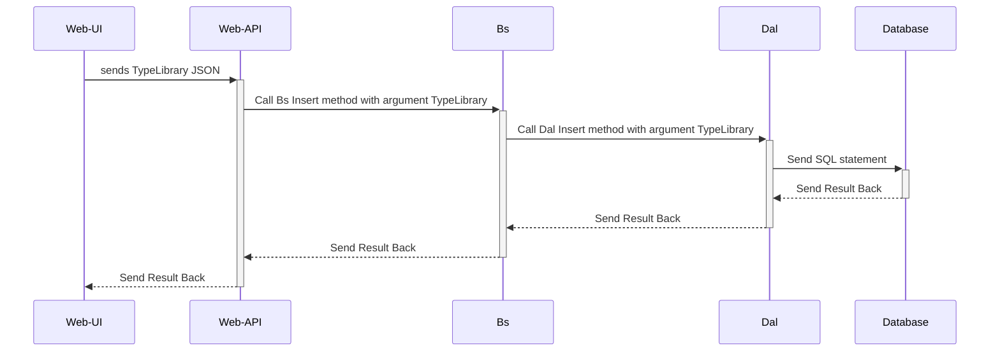

# karkas
======

## Database first

Karkas works according to **database first** principle.

## Supported databases 

Karkas supports following databases:

1. Sql Server
2. Oracle
3. Sqlite

## Code generation

Code generation has following interfaces:

- console app
- windows forms (Windows only)
- Asp.Net (planned)

Using above interfaces and given database schema, karkas generates following code libraries for every table.

- TypeLibrary (POCO plain ordinary csharp objects)
- Dal (Data Access Layer)
- Bs (Business Services)

## How it works after code generation 1

## Usage

...

## Installation 

Unfortunately, there is no easy installation right now.
Clone the project and run the Karkas.CodeGeneration.WinApp project in Visual Studio

## Requirements

Karkas uses Visual Studio 2022 but generated code is usable from .NET 4, .Net Core 1-3 and .Net 6, and .Net 7 and .Net 8.

## Contributing

See CONTRIBUTING file.

## Running the Tests

TODO

## Credits

...

## License

Karkas is released under the BSD-3 License. 
See the bundled LICENSE file for details.
