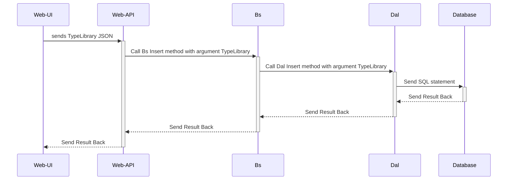

# karkas
======

## How it works after code generation 1

Aşağıdaki parçalardan oluşur.
 1. DAL - Data Access Library - Veri Ulaşım Kütüphanesi
 2. Code Generation

Bu hem kendisine ait bir kod kütüphanesi hemde bir code generation - kod üretme mantığı ile çalışmaktadır.

Aşağıdaki Veritabanlarını desteklemektedir.
 1. Sql Server
 2. Oracle
 3. Sqlite

## TODO

- Refactoring methods to English Only Names
- Remove Sqlite support and put json files for configuration. Instead of storing connection information in sqlite, json files will allow for version control also.
- Add configuration method which initializes from configuration files (app.config ...)
- Read logging and fix it

## Usage

...

## Installation 

Unfortunately, there is no easy installation right now.
Clone the project and run the Karkas.CodeGeneration.WinApp project in Visual Studio

## Requirements

Karkas uses Visual Studio 2022 but generated code is usable from .NET 4, .Net Core 1-3 and .Net 6, and .Net 7.

## Contributing

See CONTRIBUTING file.

## Running the Tests

TODO

## Credits

...

## License

Karkas is released under the MIT License. See the bundled LICENSE file for
details.
