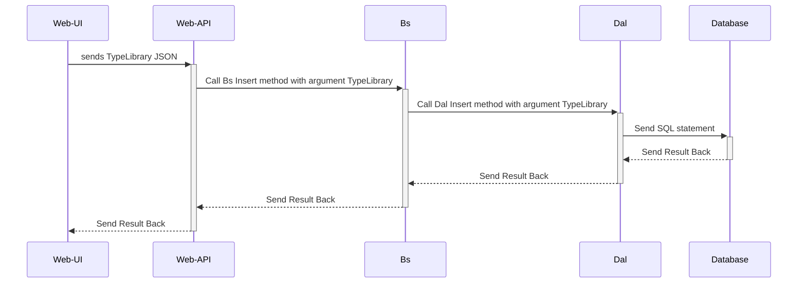

# karkas
======

## Database first principle

Karkas works according to **database first** principle.
Given a database schema, **karkas-codegen** console application generates data application code.


## Supported databases 

Karkas supports following databases:

1. Sql Server
2. Oracle
3. Sqlite


## Code generation

Code generation has following interfaces:

- console app (suggested)
- windows forms (Windows only)
- Asp.Net (planned)

Using above interfaces and given database schema, karkas generates following classes for every table.

- TypeLibrary/POCO Plain ordinary C#/CLR objects)
- Dal (Data Access Layer)
    * CRUD Code
    * QueryByPrimaryKey
    * QueryByForeignKey
- Bs (Business Services)
    * Transaction for multiple tables


## How it works after code generation 1




## Usage

...

## Installation & Usage

1. Install karkas-codegen

    dotnet tool install --global Karkas.CodeGeneration.ConsoleApp


2. Check it is installed correctly by running **karkas-codegen** in your shell, cmd or bash.

```bash
$ karkas-codegen
Karkas.CodeGeneration.ConsoleApp 1.0.3+eaac63ca88056d611bbe10f434fc9ebcc67aad00
Copyright (C) 2024 Karkas.CodeGeneration.ConsoleApp
ERROR(S):
Required option 'c, connectionname' is missing.
  -v, --verbose           Enable verbose output.
  -c, --connectionname    Required. Which connection name will be used in config.json
  -f, --configfilename    default configuration filename is karkas-config.json
  --help                  Display this help screen.
  --version               Display version information.   
```

2. Create following karkas-config.json file. You can [download](Karkas.Examples/karkas-config-sample.json) it also. 


```json
[
    {
    "ConnectionName": "sample",
    "ConnectionDatabaseType": "sqlite",
    "ConnectionDbProviderName": "Microsoft.Data.Sqlite",
    "ConnectionString": "Data Source=Databases/sample.sqlite;Mode=ReadWrite;",
    "ProjectNameSpace": "Karkas.Examples.Sample",
    "CodeGenerationDirectory": "./GeneratedProjects/sample"
    }
]
```

This file points to sqlite sample database with a Blog table.

3. run following command

## Requirements

Karkas currently uses and supports .Net 8/.Net 9 but generated code is usable from .NET 4, .Net Core 1-3 and .Net 6,7,8,9.


## Contributing

See CONTRIBUTING file.

## Running the Tests

See [github actions](https://github.com/ati-ozgur/Karkas/actions).

- Oracle and Sql Server tests are run using docker containers.
- Sqlite tests are run on github runners itself.

Tests 

- check code generation
- CRUD for tables
- Queries
- Transaction commit/rollback


## Credits

...

## License

Karkas is released under the BSD-3 License. 
See the bundled LICENSE file for details.
